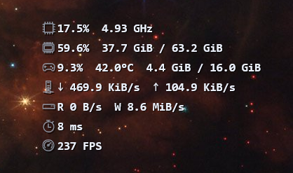

<div align="center">

# Pacecar

**A thin, always-on-top system-metrics overlay for gaming and desktop use.**

Native Win32 + Direct2D + DirectWrite · C++20 · static CRT · no runtime dependency

[](#build-from-source)
[](#requirements)
[](#testing)
[](#performance)



</div>

Pacecar shows the numbers you actually care about while you play or benchmark — CPU, memory, GPU,
network, disk, and ping — as a translucent, draggable, click-through overlay that stays out of the
way. It keeps a small footprint, samples on a coarse timer, and re-renders only when values change,
so it doesn't steal frames from the thing you're measuring.

It is a ground-up native rewrite of the original Rust/egui app (`legacy/`), built to be debugged in
Visual Studio and to align with modern Windows and C++ engineering practice.

---

## Highlights

- **Native and dependency-free.** Plain Win32, Direct2D, and DirectWrite shipped in-box; statically
  linked CRT (`/MT`), so there is no VC++ redistributable to install.
- **Stays out of the way.** Borderless, non-activating, topmost. Interactive when you want it,
  click-through when you don't. No title bar, no taskbar entry.
- **Render-on-change.** The sampler polls on a configurable 250 ms–5 s cadence and the overlay only
  repaints when a value actually changes (default 1 s, 250 ms floor).
- **Honest metrics.** Every optional value carries an availability/staleness status, and the UI shows
  a clear placeholder instead of a fake zero when a source is missing.
- **Least privilege by design.** The UI is manifested `asInvoker` and never elevates. Privileged
  sensors and ETW frame capture live in a separate, optional helper process.
- **Deep customisation.** Six presentation views, per-tile and per-field toggles, gauges or
  sparklines, layout presets including a fully custom drag/resize grid.
- **Tray + global hotkeys.** Control everything without leaving the game.

## Views

Cycle presentation at runtime from the **View** menu, the tray, or the cycle-view hotkey.

| View | What it shows |
|------|---------------|
| **Full panel** | Header, tiles, and visuals — the classic dashboard. |
| **Large visuals** | Fewer, bigger tiles with values drawn in and around the gauge/graph. |
| **Small text** | Compact label-per-line readout, no visuals. |
| **Stat rows** | One plain text line per stat, stacked — the minimal default. |
| **FPS text** | A stat-rows list limited to the FPS / frame-time readout. |
| **FPS only** | Just the FPS counter. |

The text views pair best with a transparent background, so the overlay reads as plain numbers
floating over the desktop or game.

## Metrics

### Baseline — no administrator rights, no vendor SDK

| Metric | Source |
|--------|--------|
| CPU total & per-core utilization | `NtQuerySystemInformation` delta, `GetSystemTimes` fallback |
| CPU effective frequency | PDH `% Processor Performance` × `Processor Frequency`, then `CallNtPowerInformation` |
| CPU temperature | ACPI thermal zone via `CallNtPowerInformation` (best-effort, clearly labelled) |
| Memory used/total, commit, cache | `GlobalMemoryStatusEx`, `GetPerformanceInfo` |
| GPU utilization | PDH `GPU Engine` counters (per-engine, one documented max/3D aggregation rule) |
| GPU VRAM | Vendor SDK, then D3DKMT segments / PDH GPU Adapter Memory |
| Network up/down | `GetIfTable2` octet deltas over a QPC-measured window |
| Disk read/write | PDH `PhysicalDisk` byte-rate counters |
| Ping RTT | `IcmpSendEcho` to a configurable IPv4 target |

Vendor SDKs are loaded at runtime and used only when present: **NVML** (NVIDIA) adds utilization,
temperature, power, clocks, memory, and fan; **ADLX** (AMD) and **IGCL** (Intel) are detected but
currently enrichment-only. A GPU without any vendor SDK is a strict no-op and keeps the PDH
baseline.

### Opt-in deep sensors — via the elevated helper

Enable **Deep sensors** in Settings and Pacecar launches a small .NET/LibreHardwareMonitor helper
that prompts for elevation once. Through a secured local named pipe it streams:

- CPU package/core temperature
- Mainboard and DIMM temperature
- Case and CPU fan RPM
- Disk temperature

The helper is built on **PawnIO** (signed). WinRing0 is never used. When the helper is absent or the
user declines elevation, Pacecar simply reports those metrics as unavailable.

### Opt-in FPS / frame times

FPS and frame-time capture uses an **ETW** session owned by the helper (the same providers PresentMon
uses). It never hooks or injects into the game. Capture is off by default, starts only on demand,
and is shown only while active, because ETW adds measurable load and can conflict with other capture
tools.

## Requirements

- **Windows 10 22H2 / Windows 11, x64.**
- **Visual Studio 2022 or newer** with the *Desktop development with C++* workload (MSVC `v145`/`v143`
  toolset and the Windows SDK).
- **vcpkg** (bundled with Visual Studio or standalone), discoverable via `VCPKG_ROOT`.
- **PowerShell 7+** for the helper scripts.
- Optional: the **.NET 8 SDK** to build the sensor/ETW helper. Without it the native app still builds.

## Build from source

```pwsh
# Debug
pwsh -NoProfile -ExecutionPolicy Bypass -File scripts/build.ps1 -Configuration Debug

# Release with warnings-as-errors, code analysis, and tests
pwsh -NoProfile -ExecutionPolicy Bypass -File scripts/build.ps1 -Configuration Release -Test
```

Artifacts land in `out\x64\<Configuration>\` (`Pacecar.Overlay.exe`, `Pacecar.Core.lib`,
`Pacecar.App.Tests.exe`). The first build runs `vcpkg install` in manifest mode and can take a few
minutes. No CMake, no NuGet, and no global vcpkg installs are required.

See [`docs/BUILDING.md`](docs/BUILDING.md) for direct MSBuild invocation, conventions, and
troubleshooting.

## Run

```pwsh
.\out\x64\Release\Pacecar.Overlay.exe
```

The overlay starts in your configured state; right-click it (or use the tray) for the menu. Useful
flags:

```
--click-through        force click-through input
--interactive          force interactive input
--recipe=a|b           layered (default) or DirectComposition prototype
--config=PATH          use an alternate config file
--diagnostics          print renderer/HDR/capture findings and exit
--measure[=SECONDS]    run visible, print overhead, then exit
--no-tray --no-hotkey  disable shell integration (tests/measure)
--open-window=NAME     open settings|specs|history at startup
--exit-after=MS        cleanly exit after N ms
```

## Configuration & hotkeys

Settings live at `%APPDATA%\Pacecar\config.json` — human-readable JSON, written atomically and
debounced 500 ms after the last change. The Settings window edits General, Overlay, Tiles, Sensors,
History, and Hotkeys groups, and changes apply live.

**Default hotkeys**

| Action | Default |
|--------|---------|
| Toggle overlay | `Ctrl+Shift+P` |
| Cycle view | `Alt+F12` |
| Toggle background | `Ctrl+Shift+B` |
| Toggle FPS capture | `Alt+F11` |
| Toggle click-through | *(unbound)* |

Hotkeys are re-registered live when changed — no restart. A conflicting binding is logged and the
app keeps running.

## Interaction

- **Interactive mode** — drag anywhere to move, drag edges/corners to resize, right-click for the
  context menu.
- **Click-through mode** — input passes straight through to the window below; the layered window is
  the documented click-through recipe (`WS_EX_LAYERED | WS_EX_TRANSPARENT`). Toggle back from the
  tray or hotkey.
- **Tray** — Show/Hide, View, transparent background, Mode, Settings, History, FPS capture, Copy
  system info, About, Exit. Double-click toggles visibility.
- Window position and size persist **per monitor**, and per-monitor DPI is honoured.

## Architecture

```
Pacecar.Overlay.exe  (unelevated, asInvoker)
├── UI pump + overlay window (Win32, Direct2D/DirectWrite, layered by default)
├── Tray, global hotkeys, single-instance guard, lifecycle
├── Sampler thread ──► provider aggregator ──► published snapshot (lock-free read)
│                        ├── baseline providers (CPU, memory, GPU PDH/D3DKMT, net, disk, ping)
│                        ├── vendor GPU providers (NVML / ADLX / IGCL, loaded at runtime)
│                        └── SensorHelperClient ──┐
└── Settings / Specs / History windows            │
                                                   ▼
                             Pacecar.Sensors.exe (optional, elevated, .NET)
                             └── PawnIO/LibreHardwareMonitor sensors + ETW frame-time session
                                  over a DACL-secured named pipe (local only)
```

- **Single UI thread** owns every window and the message pump; the sampler runs off the render path.
- **`Pacecar.Core`** is a UI-free static library holding the config, metrics model, providers,
  aggregator, layout engine, and utilities — all unit-testable without a window.
- The helper speaks a versioned, fixed-layout IPC schema (`IpcProtocol`) shared by both sides.

## Performance & privacy

- Render-on-change gate with a hard 250 ms floor; coarse timers; EcoQoS-friendly sampling thread.
- Fixed-capacity ring buffers are reserved once — no allocation on the sample or render path.
- Capture exclusion (`WDA_EXCLUDEFROMCAPTURE`) is on by default so the overlay doesn't pollute your
  recordings.
- The overlay performs **no network calls of its own**; ping targets and vendor SDKs are the only
  outbound/telemetry surfaces, and both are explicit and configurable.
- The helper is confined to a separate process, started on demand, and terminated when you disable
  it or exit.

## Testing

`Pacecar.App.Tests` is a Google Test console executable covering config, the metrics model and every
provider, smoothing/formatting, the layout engine, Settings/History binding, IPC protocol, pipe
security, and lifecycle:

```pwsh
.\out\x64\Release\Pacecar.App.Tests.exe
```

A non-zero exit code means failure. Run the same gate used by the build with:

```pwsh
pwsh -NoProfile -ExecutionPolicy Bypass -File scripts/verify.ps1
```

## Project layout

```
pacecar.slnx                  MSBuild solution
src/Pacecar.Core/             UI-free static library (C++20) — config, metrics, layout, utils
src/Pacecar.Overlay/          Win32 EXE — windows, widgets, tray, hotkeys, sampler
src/Pacecar.App.Tests/        Google Test executable
helper/Pacecar.Sensors/       Optional elevated .NET helper (LibreHardwareMonitor + ETW)
assets/                       Icons and screenshots
build/                        Shared MSBuild props/targets + vcpkg import
scripts/                      build.ps1, verify.ps1, helpers
vcpkg.json                    Manifest: wil, nlohmann-json, gtest (x64-windows-static)
docs/                         Design docs, ADRs, and task notes
```

## Status & roadmap

The native rewrite has completed its core phases (foundation, baseline metrics, overlay, widgets,
layout, sampling, shell, and windows) plus vendor GPU providers and the secured sensor helper. FPS /
frame-time capture is implemented and opt-in; packaging, CI, and overhead checks remain. The
original Rust/egui implementation is kept under `legacy/` for reference.

## Credits

Pacecar is inspired by the original Rust/egui app and draws on the metrics knowledge of the
LibreHardwareMonitor / PresentMon communities. Third-party notices ship with the helper.